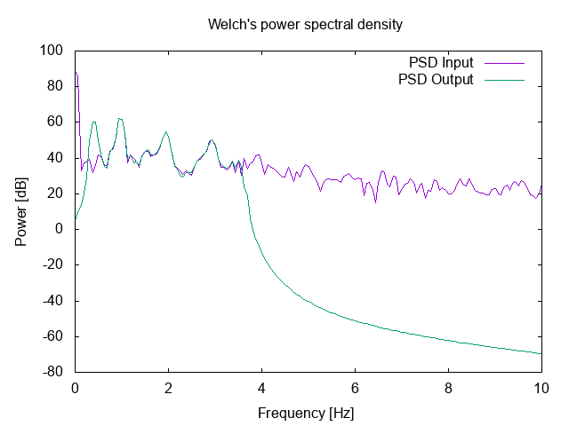

# GODSP 
Library for digital signal processing.

## Tools 
### IIR Passband FIlter (*Filtfilt from matlab*)

*Filtered Signal*

*Filtered PSD Signal*

### Welch PSD (*pwelch from matlab*)

*PSD for the frequencies of interest*

