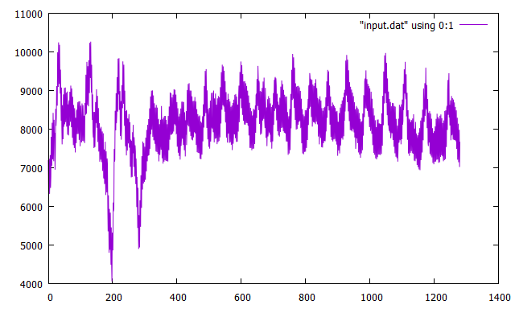
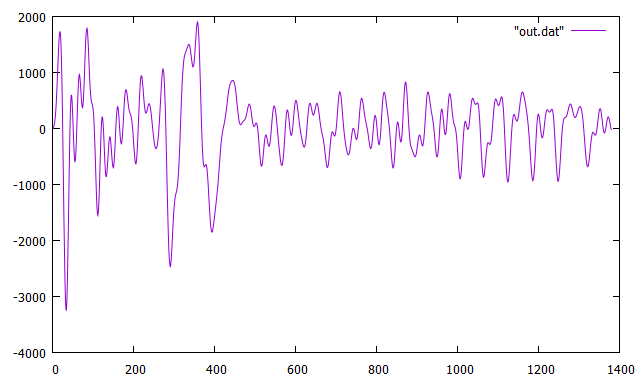

# ZPK Filter
This script uses `input.dat` to filter using zpk algorithm implemented in function `IIR_filter_SOS` in `godsp.go`.

## Images
Input signal

Output filtered signal (Using ZPK IIR Filter)

